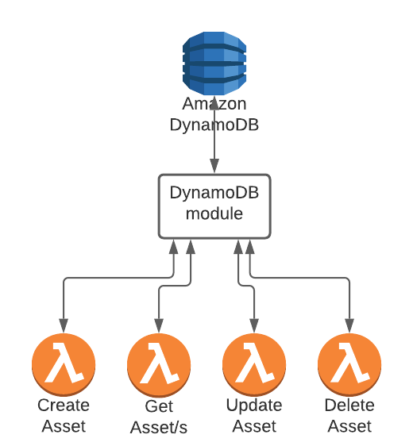

[<- back](https://redesigned-broccoli-e56e9071.pages.github.io/services/)

# Asset Service

# Description
- Responsible for managing the asset entity.
- Asset belongs to a tenant and represents a unit to run security tests against, like a Github Repo or a Slack channel.
- The service is a CRUD service over DynamoDB.
- The service is used internally only protected by IAM, and is not exposed on the Internet.
- The service is not accessing any 3rd party API.
- Asset has an `is_active` flag that is used for soft delete.
- All endpoints return only active entities, currently there is no option to retrieve deleted entities.

# Architecture
[](https://lucid.app/lucidchart/b14529ae-51e6-4c45-af33-7b5ff52bc912/edit?referringApp=slack&shared=true&page=ME7XSgyz.ExU#)

See high level architecture [here](https://lucid.app/lucidchart/b14529ae-51e6-4c45-af33-7b5ff52bc912/edit?referringApp=slack&shared=true&page=ME7XSgyz.ExU#)


# Flows
## 1. Create an Asset
- Lambda to create a single Asset object.
- If the asset was previously deleted, it should be recreated (marked as is_active = True)
- The lambda is exposed on API Gateway and protected by IAM.
- The lambda will persist the Asset on DynamoDB.
- No validation is done on the given tenant_id.
## 2. Get Assets by tenant id
- Lambda to get all Assets by tenant_id.
- The lambda is exposed on API Gateway and protected by IAM.
- The results may be sorted by risk score and limited to x assets using query params.
- The lambda will query the DynamoDB and respond with list of Assets.
## 3. Get a single Asset by key attributes
- Lambda to get a single Asset by asset_type, vendor, owner and asset_name.
- The lambda is exposed on API Gateway and protected by IAM.
params.
- The lambda will query the DynamoDB and respond with Asset object.
## 4. Get a single Asset by asset_id and tenant_id
- Lambda to get a single Asset by asset_id and tenant_id.
- The lambda is exposed on API Gateway and protected by IAM.
params.
- The lambda will query the DynamoDB and respond with Asset object.
## 5. Update risk attributes of an Asset
- Lambda to update a single Asset by tenant_id and asset_id.
- The lambda is exposed on API Gateway and protected by IAM.
- The lambda will persist the change in the DynamoDB and respond with the updated object.
## 6. Delete an Asset
- Lambda to delete a single Asset by tenant_id and asset_id.
- The Asset is soft-deleted using the is_active attribute.
- The lambda is exposed on API Gateway and protected by IAM.


# Interfaces
## Endpoints
### [POST] Create Assets
- Description
  - Get a list of Asset requests and split it to new Assets and previously deleted Assets.
  - Ignore existing Assets.
  - Creates a list of new Asset for a Tenant.
  - Re-activate a list of previously deleted Assets.
  - Returns the sum of created and re-activated Assets.
- Request: `POST /`
```javascript
 [{
    asset_type,
    asset_name,
    vendor,
    owner
}]
```
- Response: HTTP 201
```javascript
{
    assets_created_count
}
```
- Authentication/Authorization: Protected by IAM.
- Availability: Exposed internally only.
- Relevant HTTP statuses: 400, 403, 500

### [GET] Get Assets
- Description
  - Get all Assets by tenant_id.
  - Will query for active Assets only.
  - Returns a list of Asset objects.
- Request: `GET /[?sort_by=risk_score&sort_order=desc&limit=<number>`
- Response: HTTP 200
```javascript
[{
    tenant_id,
    asset_id,
    asset_type,
    asset_name,
    vendor,
    owner,
    risk_status,
    risk_score,
    is_active,
    is_covered,
    created_at,
    modified_at,
}]
```
- Authentication/Authorization: Protected by IAM.
- Availability: Exposed internally only.
- Relevant HTTP statuses: 400, 403, 404, 500

### [GET] Get Asset by asset_id
- Description
  - Get a single Asset by tenant_id and asset_id.
  - Will return an active Assets only.
  - Returns an Asset objects.
- Request: `GET /asset/<asset_id>`
- Response: HTTP 200
```javascript
{
    tenant_id,
    asset_id,
    asset_type,
    asset_name,
    vendor,
    owner,
    risk_status,
    risk_score,
    is_active,
    is_covered,
    created_at,
    modified_at,
}
```
- Authentication/Authorization: Protected by IAM.
- Availability: Exposed internally only.
- Relevant HTTP statuses: 400, 403, 404, 500

### [GET] Get Asset by key attributes
- Description
  - Get single Asset by tenant_id, asset_type, vendor, owner and asset_name.
  - Will query for active Assets only.
  - Returns a single Asset object.
- Request: `GET /type/<asset_type>/vendor/<vendor>/owner/<owner>/name/<asset_name>`
- Response: HTTP 200
```javascript
{
    tenant_id,
    asset_id,
    asset_type,
    asset_name,
    vendor,
    owner,
    risk_status,
    risk_score,
    is_active,
    is_covered,
    created_at,
    modified_at,
]
```
- Authentication/Authorization: Protected by IAM.
- Availability: Exposed internally only.
- Relevant HTTP statuses: 400, 403, 404, 500

### [PATCH] Update Asset
- Description
  - Updates an Asset with `risk_status` and `risk_score`.
  - Returns the updated Asset.
- Request: `PATCH /asset/<asset_id>`
```javascript
{
    risk_status,
    risk_score,
}
```
- Response: HTTP 200
```javascript
{
    tenant_id,
    asset_id,
    asset_type,
    asset_name,
    vendor,
    owner,
    risk_status,
    risk_score,
    is_active,
    is_covered,
    created_at,
    modified_at,
}
```
- Authentication/Authorization: Protected by IAM.
- Availability: Exposed internally only.
- Relevant HTTP statuses: 400, 403, 404, 500


### [PATCH] Update Multiple Assets
- Description
  - Updates multiple Assets.
  - Returns the updated Assets.
- Request: `PATCH /assets`
```javascript
[{
    risk_status,
    risk_score,
    new_name,
    is_covered,
    asset_id,
}]
```
- Response: HTTP 200
```javascript
[{
    tenant_id,
    asset_id,
    asset_type,
    asset_name,
    vendor,
    owner,
    risk_status,
    risk_score,
    is_active,
    is_covered,
    created_at,
    modified_at,
}]
```
- Authentication/Authorization: Protected by Custom Authorizer.
- Availability: available for public usage.
- Relevant HTTP statuses: 400, 403, 404, 500

### [POST] Delete multiple Assets
- Description
  - Soft delete an Asset by marking it as `is_active = False`.
- Request: `POST /`
```bash
#asset_ids
[
  "3e8fsfdsfsdf-fsdfsdfsd-fsddsdsf-dsadsad",
  "4c9fsfdsfsdf-fsdfsdfsd-fsddsdsf-dsadsad",
]
```
- Response: HTTP 204
- Authentication/Authorization: Protected by IAM.
- Availability: Exposed internally only.
- Relevant HTTP statuses: 403, 404, 500


# Data model
## ERD Schema
- A single table contains a single Asset entity.
- The table key namings is consistent with single table design pattern, allowing addition of other entities in the future.
- Asset id is created by the asset-service and is unique across all tenants.
- An Asset uniqueness is also kept by the attributes: type, vendor, owner and name.


## Access pattern
Asset:
- Get all Assets by tenant id (GSI3PK).
- Get top N risky Assets by tenant id (GSI3PK, GSI3SK).
- Get Asset by id (used in the update Asset flow) (PK, SK).
- Get Asset by key attributes (GSI1PK, GSI1SK).
- Get Asset by tenant_id and asset_id (PK, SK).

## Entity chart
Asset
```python
{
    tenant_id: str
    asset_id: str
    asset_type: str
    asset_name: str
    vendor: str
    owner: str
    risk_status: str
    risk_score: int
    is_active: bool
    is_covered: bool
    created_at: str
    modified_at: str
}
```

| Entity | PK                 | SK               |
| ------ | ------------------ | ---------------- |
| Asset  | TENANT#{tenant_id} | ASSET#{asset_id} |

| Entity | GSI1PK                                                        | GSI1SK                                |
| ------ | ------------------------------------------------------------- | ------------------------------------- |
| Asset  | TYPE{asset_type}#VENDOR{vendor}#OWNER{owner}#NAME{asset_name} | TENANT#{tenant_id}#ACTIVE#{is_active} |

| Entity | GSI2PK                                | GSI2SK                                |
| ------ | ------------------------------------- | ------------------------------------- |
| Asset  | TENANT#{tenant_id}#ACTIVE#{is_active} | TENANT#{tenant_id}#ACTIVE#{is_active} |

| Entity | GSI3PK                                | GSI3SK       |
| ------ | ------------------------------------- | ------------ |
| Asset  | TENANT#{tenant_id}#ACTIVE#{is_active} | {risk_score} |

| Entity | LSI1SK       | LSI2SK               |
| ------ | ------------ | -------------------- |
| Asset  | {risk_score} | STATUS#{risk_status} |


# Dependencies
This microservice does not depend on other microservices.
